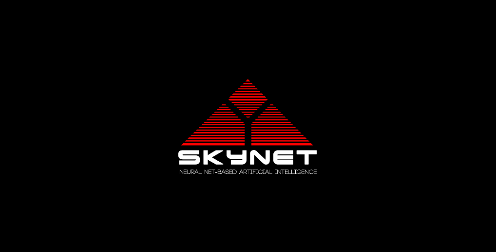

# SkyNet: A Numpy-powered, 100% Hand Made, Machine Learning Library 🚀

Welcome to SkyNet! This is my personal machine learning library. It is entirely made from scratch, using only NumPy. No professional machine learning libraries like Scikit-Learn, TensorFlow, or PyTorch are allowed. Everything is made by applying the fundamental concepts of machine learning. It supports both classical algorithms, supervised and unsupervised, as well as deep learning. This project is in its first stages, so there is a lot more to come. This serves as a showcase of my skills and conceptual knowledge in machine learning, calculus, linear algebra, and statistics. Stay tuned, because there is a lot more to be implemented here!



> **Disclaimer**: SkyNet is, at its heart, a project of passion and learning. Please refrain from deploying it in a professional setting. While meticulously crafted, it doesn't leverage state-of-the-art optimization and lacks GPU support.

## Table of Contents
1. [Features](#features)
2. [Installation](#installation)
3. [Usage](#usage)
4. [Acknowledgements](#acknowledgements)

## Features
- **NumPy Powered:** SkyNet is built entirely with NumPy, showcasing a true understanding of the algorithms.
- **Classical Machine Learning:** SkyNet supports both supervised and unsupervised machine learning models.
- **Custom Neural Nets:** SkyNet allows you to create custom neural networks with customizable layers, multiple activation functions, and optimization methods.
- **Transparency:** SkyNet's code is well-documented with detailed comments and docstrings to guide you through each part of the code.

## Installation

Install `skynet_ml` directly from PyPI:

```bash
pip install skynet-ml
```

## Usage
Getting started with SkyNet is pretty straightforward. Here's a step-by-step guide:

1. **Setup Your Environment:**

Before diving in, ensure you have numpy:
```bash
pip install numpy
```

2. **Enter skynet:** 

Navigate to the SkyNet directory:
```bash
cd skynet
```

3. **Make Magic!:** 
```bash
# import all the stuff you need 
from skynet_ml.deep.layers import Dense
from skynet_ml.deep.models import Sequential
from skynet_ml.deep.initializers import Random
from skynet_ml.deep.optimizers import SGD

# initialize the model object 
model = Sequential()

# insert the layers you want
model.add(Dense(2, 3, activation="sigmoid", has_bias=True, initializer=Random()))
model.add(Dense(3, 3, activation="sigmoid", has_bias=True, initializer=Random()))
model.add(Dense(3, 1, activation="linear", has_bias=True, initializer=Random()))

# compile your model
opt = SGD(learning_rate=0.01)
model.compile(optimizer=opt, loss="mse")

# create training data (features as columns)
X = np.array([
    np.array([0.5, 0.2]),
    np.array([0.1, 0.6])
])

y = np.array([
    np.array([0.7, 0.8])
])

# fit your model -> This is where everything goes wrong, SkyNet takes the planet and everyone dies! That's a joke, it's just calculus. 
model.fit(X, y, epochs=10000, batch_size=2)

# predict with your model 
model.predict(X)
```

## Acknowledgements

- Big thanks to Numpy for being the foundation of this project.
- Grateful for my professor Lucas Kupssinsku who is teaching me all this stuff. 
- Big thanks to Ian Goodfellow for writing a bible about deep learning. 
- Big thanks to my boy chatGPT, who wrote 90% of the docstrings because I'm way to lazzy (including this docstring hehe).


> **Disclaimer**: SkyNet is a personal project and it's not designed for professional use. Therefore, do not sue me for using the same name as the evil A.I in The Terminator, the name is a joke. 